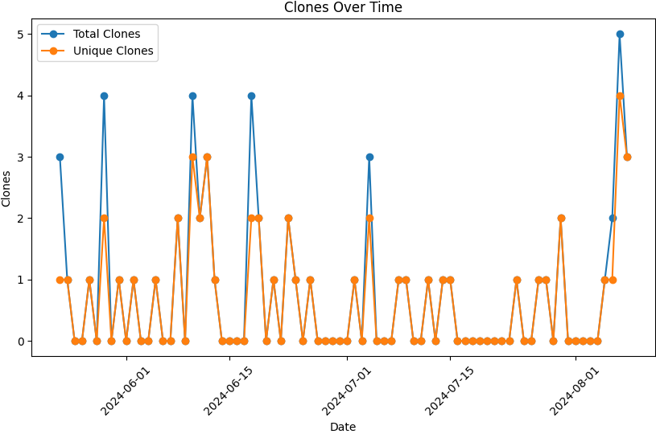

# QuESt_Usage

A program used to update the README.md on the main quest github page and keep track of all of the clones, most visited paths, main referrers, and the downloads of the releases.
It provides tables and charts for the visits and the totals and updates the readme daily.

<!-- PLOT_PLACEHOLDER_START -->

<!-- PLOT_PLACEHOLDER_END -->

<!-- TABLE_DOWNLOADS_PLACEHOLDER_START -->
| Asset Name                    |   Download Count |
|:------------------------------|-----------------:|
| quest_apps_prebuilt_win64.zip |               12 |
| quest_installer_win64.exe     |               30 |
| quest_prebuilt_win64.zip      |               26 |
| QuESt.1.6-beta.zip            |              394 |
| snl-quest-1.2.f-win10.zip     |              742 |
| snl-quest-1.2.e-win10.zip     |              197 |
| snl-quest-1.2.d-win10.zip     |              111 |
| snl-quest-1.2.c-win10.zip     |               86 |
| Total                         |             1598 |
<!-- TABLE_DOWNLOADS_PLACEHOLDER_END -->

<!-- TABLE_PATHS_PLACEHOLDER_START -->
| Most Visited Path                                                                             |   Times Visited |   Unique Visits |
|:----------------------------------------------------------------------------------------------|----------------:|----------------:|
| /sandialabs/snl-quest                                                                         |             898 |             488 |
| /sandialabs/snl-quest/tree/master/snl_libraries/data_manager/es_gui/apps/data_manager         |              51 |               3 |
| /sandialabs/snl-quest/issues/30                                                               |              69 |              56 |
| /sandialabs/snl-quest/blob/master/main.py                                                     |              12 |               4 |
| /sandialabs/snl-quest/tree/master/__pycache__                                                 |              41 |               8 |
| /sandialabs/snl-quest/tree/master/docs                                                        |              76 |              22 |
| /sandialabs/snl-quest/issues/48                                                               |               9 |               5 |
| /sandialabs/snl-quest/tree/master/snl_libraries/data_manager/es_gui/apps/data_manager/_static |               9 |               1 |
| /sandialabs/snl-quest/tree/master                                                             |             104 |              37 |
| /sandialabs/snl-quest/blob/master/README.md                                                   |              42 |              10 |
| /sandialabs/snl-quest/tree/master/snl_libraries                                               |             103 |              24 |
| /sandialabs/snl-quest/blob/master/resources_rc.py                                             |              22 |               6 |
| /sandialabs/snl-quest/blob/master/setup.py                                                    |               9 |               3 |
| /sandialabs/snl-quest/tree/master/data                                                        |             130 |              32 |
| /sandialabs/snl-quest/tree/master/app                                                         |             103 |              27 |
| /sandialabs/snl-quest/blob/master/images/read/home_page.png                                   |              45 |              18 |
| /sandialabs/snl-quest/tree/master/app/data_vis                                                |              20 |               4 |
| /sandialabs/snl-quest/tree/master/app/tools                                                   |               9 |               3 |
| /sandialabs/snl-quest/tree/master/images                                                      |              12 |               3 |
| /sandialabs/snl-quest/issues                                                                  |              46 |               7 |
| /sandialabs/snl-quest/tree/master/snl_libraries/data_manager                                  |              45 |               7 |
| /sandialabs/snl-quest/tree/master/data/SPP                                                    |              30 |               8 |
| /sandialabs/snl-quest/tree/master/plots                                                       |              13 |               5 |
| Total                                                                                         |            1898 |             781 |
<!-- TABLE_PATHS_PLACEHOLDER_END -->

<!-- TABLE_REFERRERS_PLACEHOLDER_START -->
| Referrer                      |   Number of Referrals |   Unique Referrals |
|:------------------------------|----------------------:|-------------------:|
| sandia.gov                    |                   445 |                 98 |
| Google                        |                   586 |                200 |
| github.com                    |                   427 |                 95 |
| u-cursos.cl                   |                    94 |                  7 |
| linkedin.com                  |                     3 |                  3 |
| yandex.ru                     |                     3 |                  3 |
| opensustain.tech              |                     4 |                  4 |
| Bing                          |                   430 |                 17 |
| energy.gov                    |                     4 |                  4 |
| statics.teams.cdn.office.net  |                     8 |                  6 |
| yandex.by                     |                     4 |                  2 |
| DuckDuckGo                    |                    47 |                  4 |
| puspalhazra.com               |                     2 |                  2 |
| puspalhazra.info              |                     1 |                  1 |
| link.zhihu.com                |                    15 |                  1 |
| gbc-excel.officeapps.live.com |                     6 |                  5 |
| search.brave.com              |                     1 |                  1 |
| Total                         |                  2080 |                453 |
<!-- TABLE_REFERRERS_PLACEHOLDER_END -->
